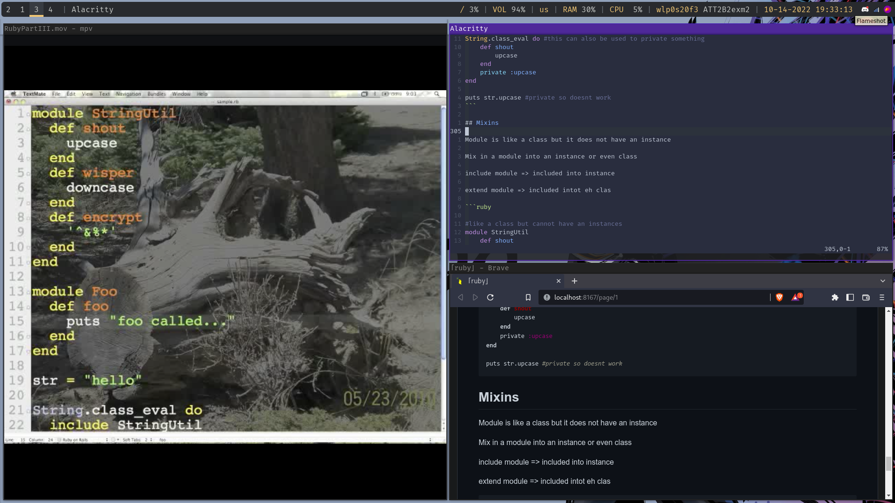
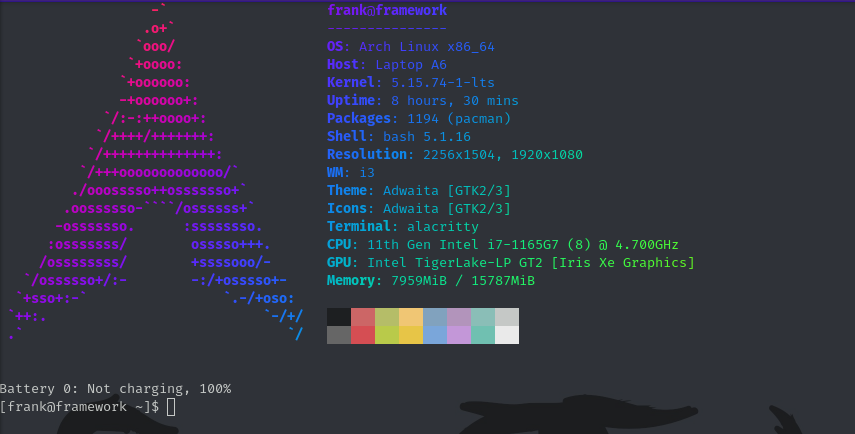

Just my current dot files for my arch linux install

The customizations are just me wanting it and doing it. There is nothing really here and most of it is little customization

The point of this is for me to just cp if for whatever reason I needa reinstall arch again... gotta love rolling release :D Ive had to reinstall a couple times for diff reasons. Most recent was instability with Linux kernal so I had to swap to Linux-LTS.

I made a very simple shell script that checks differences in files so I dont have to worry about doing it myself manually or changing this every time I modify something

# Configs, Programs, Usage
- i3 - I prefer a wm over de
    - flameshot - screen shot
    - nitrogen - wallpaper
    - nm-applet - gui for network manager
    - spotify -... well music :D
    - xrandr - I think it comes from like xorg or just whatever but im using it to set up my external display to use
    - picom - allows for my transparency lmao, thats all ik of this vid compositer
    - poly bar - prefer over i3 bar
    - i3 lock - locks my screen duh. I use flameshot to screenshot my screen then imagemagick to blur the image and then use it for my i3 lock as the lock screen instead of a flashbang of pure white (all done in i3lock.sh)
- picom - Just a compositer that I use for the transparency of terminal.
- polybar - barely modified configs but I prefer this asthetic out of the box over i3 bar
- alacritty - current prefered terminal of choice since out of box its nice
    - neofetch - well duh
        - lolcat - no idea what it does I just installed for the gradient on neofetch lol
    - acpi - to tell battery percentage, I have it call for acpi everytime I open the terminal
- bashrc - well I just use bash no particular reason why. Alias is fun + gotta have the neofetch when I open terminal
- vimrc - current vim set up. Im still trying to learn more keybindings before fousing on the extensions. Im currently happy with my vimrc anyways
- dunst - my notification daemon. I didnt have it until recently because I did not care as much about notifications; however, it came to my atention that some apps need a notification daemon and would become temporarilty unresponsive without one (spotify, discord, and flameshot). Some apps would straight up freeze without one (tetrio if I tabbed out) so it became a necessity for me I guess

# Shell Scripts
I literally spent a solid few hours googling some stuff so I can do my shell scripts the way I wanted to.
- Basically function.sh is a reused function that returns the differences in an array
- diff.sh basically returns all the diff files from the repo to my own files. I can just use diff since my personal .config files has more files than this dot_files repo
- cp.sh runs the cp command on the said files

I wrote them the way I wanted to formatted it with no shell script knowledge. I just wanted to practice decent programming practice will making this even tho it def woulda been so much easier and simplier otherwise. I literally have over 20 tabs opened cuz I wanted to automate this instead of manually doing it and also I wanted it formatted a certain way. I dont 100% understand the code unfortunatly but the only part I didnt understand is the array part... the returning and using it.

# Images/Screenshots

My arch linux is pretty barebones. Little customization here and there. There was a point in time where I went over like 4 months without a wall paper lmao. Anyways here are some images

## Wallpapers

white is form the diff monitor resolutions. The left one, is my laptop screen and is acutally smaller (13.5" is the size) than my monitor (20 somthing")

Wallpaper is being done with nitrogen

## Notes

Basically how I am taking lecture notes at home. Source on left, vim on right and markdown preview below the vim instance.

If I use libre office for an assignment then soruce on left, libreoffice writer on right

# Terminal

